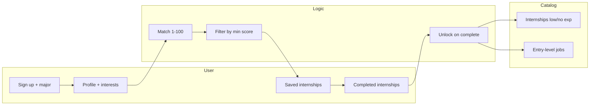

# Dashboard, matching, and app completion for UncookedAura

## 1. Gaps from existing plans (auth + landing)

**Auth framework** ([auth_framework_with_shadcn_and_turnstile_a5fc505a.plan.md](.cursor/plans/auth_framework_with_shadcn_and_turnstile_a5fc505a.plan.md)) — details not yet implemented or only briefly mentioned:

- **Sign-up payload**: name, email, password (hash/plain per backend contract), **major** (CSE, CS, Applied Math, Others), **turnstile_token**; Workers validate and store in R2; no user profile beyond this yet.
- **Skeleton reuse**: Auth card skeleton and optional “page shell skeleton” for dashboard loading/offline; dashboard job list shows skeleton when offline or loading (no prefetched job data offline).
- **Offline**: Disable submit on auth pages when `navigator.onLine === false`; show “Connect to the internet to sign in.”
- **CTAs**: “Get Started” → `/signup`; optionally add “Sign in” → `/login` on home.
- **Unauthorized**: [app/src/app/unauthorized/page.tsx](app/src/app/unauthorized/page.tsx) exists; auth flow should redirect protected routes here and point “Sign in” to `/login` (not `/`).

**Landing page** ([landing_faq_accordion_3f2284f1.plan.md](.cursor/plans/landing_faq_accordion_3f2284f1.plan.md)):

- FAQ section with 4–5 Q&As (What is UncookedAura, how matching works, free/premium, which jobs, how to get started) between JobListingsMarquee and AllToolsSection; custom accordion or shadcn Accordion.
- “How do I get started?” answer: “Sign up, complete your profile, then browse and save matching jobs” — implies **profile completion** is a distinct step after sign-up.

---

## 2. Product model (audience and flows)

**Audience**: College students (“cooked”) aiming for competitive jobs that require prior experience. That experience comes from **internships** (sourced from the web) that need **little or no experience**. Users are **matched** to internships by **personal interests** (1–100 score). Low-fit listings are **filtered out**. **Completing** internships can **unlock** more internships and build toward **entry-level roles** at larger companies.

---

## 2.1 Job data source: Jooble API

**UncookedAura will use the [Jooble REST API](https://help.jooble.org/en/support/solutions/articles/60001448238-rest-api-documentation) to retrieve real job and internship listings** instead of (or in addition to) a static R2 catalog. Jooble aggregates job markets; the app will query by keywords/location and then match results to user interests and outcomes.

**Jooble API summary**

- **Endpoint**: `POST https://jooble.org/api/{api_Key}` (API key from [jooble.org/api/about](https://jooble.org/api/about)).
- **Request body** (JSON): `keywords` (required), `location` (optional), `radius` (optional), `page` (optional), `companysearch` (optional: search company names vs title/description).
- **Response**: `totalCount`, `jobs` array per listing with `id`, `title`, `company`, `location`, `snippet`, `salary`, `type`, `link`, `source`, `updated`.

**Integration approach**

- **Server-side only**: The Jooble API key must not be exposed to the client. Either:
  - **Workers**: Cloudflare Worker calls Jooble (key in env/secrets), then scores/filters and returns results to the frontend; optionally caches responses in R2 to reduce Jooble calls and improve latency, or
  - **Next.js API route**: Next.js route (e.g. `app/api/jobs/route.ts`) calls Jooble server-side and returns normalized results; Workers then only handle auth/profile and optionally proxy to this route or duplicate logic.
- **Internship vs entry-level**: Use **keywords** to segment:
  - **Internships** (low/no experience): e.g. `keywords: "internship"` or `"intern"` plus user interest terms (e.g. "web development internship", "data analyst intern").
  - **Entry-level jobs**: e.g. `keywords: "entry level"` or "junior" combined with role/interest terms; can be gated so the frontend only requests when user has completed enough internships.
- **Matching Jooble results to users**: For each job returned by Jooble, compute a **fit score 1–100** by comparing **user interests and/or user outcomes** to the job’s **title**, **snippet**, and **type** (e.g. keyword overlap, simple tag extraction, or embedding similarity). Filter out listings below the user’s minimum score threshold. “Their requirements” = what the listing implies (from title/snippet/type); “user’s outcomes” = what the user wants (interests, goals, major) — both feed into the score.

**Env**: Add `JOOBLE_API_KEY` (server-side only) to Workers and/or Next.js; document in `app/.env.example` and [app/docs/CLOUDFLARE.md](app/docs/CLOUDFLARE.md).

---

## 3. What developers need to create

### 3.1 Data model and API contracts

**User profile (extends sign-up)**  
Stored in Workers/R2 (or backend when added). Sign-up already has: name, email, major. Add:

- **Interests**: list of tags (e.g. `["web-dev", "data", "design", "finance"]`) used both to **build Jooble keywords** and to **score** Jooble results. Source: onboarding or profile/settings.
- **Outcomes** (optional): e.g. “entry-level at big tech”, “internship in finance” — can drive which Jooble queries are run and how results are ranked.
- **Completed internship IDs**: list of Jooble job IDs (or stable app IDs) the user marked as completed (drives unlock rules).
- **Saved internship/job IDs**: list of saved/bookmarked listings.

**Job/Internship listing (from Jooble)**  
Each Jooble job has: `id`, `title`, `company`, `location`, `snippet`, `salary`, `type`, `link`, `source`, `updated`. The app will:

- Use **Jooble `id`** (or a stable composite id) for save/complete and unlock logic.
- Derive **tags / interest categories** from `title` + `snippet` (and optionally `type`) for scoring against user interests; no need for a separate curated “tags” field in Jooble — extraction can happen server-side when processing the response.
- **Internship vs entry-level**: Differentiate by the **keywords** used in the Jooble request (e.g. “internship” vs “entry level”) and/or by `type` when applicable; store or pass a flag in the app’s response so the dashboard can show “Internships” vs “Entry-level jobs” sections.
- **Unlocks**: Unlock rules are app-defined (e.g. “complete N internships unlocks entry-level query” or tier-based). Completed IDs are stored in the user profile; Workers (or backend) decide which Jooble queries and which result sets the user can see.

**Matching (Jooble results ↔ user)**

- **Input**: User **interests** (and optionally **outcomes**, **major**); Jooble raw results (title, snippet, type per job).
- **Output**: Each listing gets a **fit score 1–100** by comparing user interests/outcomes to the job’s **requirements** (inferred from title/snippet/type). E.g. keyword or tag overlap, normalized to 1–100; optionally bonus for major alignment.
- **Filter**: Only return listings with score ≥ user’s `minScore` threshold (e.g. default 50; user-adjustable in dashboard).

**Workers API extensions** (beyond current [GET /api/jobs](app/docs/CLOUDFLARE.md)):

- Auth: sign up, login, forgot-password (per auth plan).
- **User profile**: GET/PATCH profile (interests, outcomes, completed IDs, saved IDs); requires auth.
- **Job/internship search**: GET `/api/internships` and GET `/api/jobs/entry-level` (or a single GET with `type=internship|entry-level`). Backend **calls Jooble** with keywords derived from user interests/outcomes and optional location; **scores** each result against user profile; **filters** by `minScore`; returns list with `score` per item. Pagination can follow Jooble’s `page` and/or cursor. API key stays server-side (Worker or Next.js route).
- **User actions**: POST to save/unsave listing, POST to mark internship/job complete (update user’s completed list; recompute unlock state).

Optional: **R2 cache** for Jooble responses (keyed by query hash, TTL) to reduce Jooble calls and improve latency; scoring and filtering still run on the app side.

No `backend/` folder exists yet; the auth plan says “backend API will live in backend/ later.” All of the above can be implemented in **Cloudflare Workers + Jooble + R2** first (auth, profile, Jooble proxy + scoring, save/complete, progression), then moved or mirrored to a `backend/` service if needed.

---

### 3.2 Dashboard (post-login home)

- **Route**: e.g. `/dashboard` (or `/` when logged in; recommend a dedicated `/dashboard` and redirect logged-in users from `/` to `/dashboard` so landing stays public).
- **Layout**: Same shell as rest of app (header with Logo; add nav: Dashboard, Profile, Sign out). Use **page shell skeleton** (or auth card skeleton pattern) for loading; reuse skeleton for internship cards when loading or offline (per auth plan).
- **Content**:
  - **Matched internships**: List/grid of internships with **fit score** (e.g. “82% match”). Sort by score (default) or date. **Min score filter**: slider or select (e.g. 50, 60, 70, 80) so users hide low-fit listings.
  - **Saved**: Short list or link to “Saved” page; quick access to saved internships.
  - **Progress**: e.g. “You’ve completed 3 internships; 2 new opportunities unlocked.” Optional: simple progress bar or checklist.
  - **Entry-level jobs**: Section or card “Entry-level jobs” — visible when user has completed enough internships (or has required skills); list entry-level jobs from API. If not yet unlocked, show message like “Complete more internships to unlock entry-level roles.”
- **Empty states**: No matches (e.g. “Add interests in Profile”); offline (skeleton + “You’re offline” for list).

Protected route: redirect to `/unauthorized` (or `/login`) when not authenticated. Update [unauthorized](app/src/app/unauthorized/page.tsx) so “Sign in” links to `/login`.

---

### 3.3 Profile and onboarding

- **Profile / settings page** (e.g. `/dashboard/profile` or `/profile`):
  - Show and edit: name, major (from sign-up), **interests** (multi-select or tag input — same tag set as internships).
  - Optional: short “skills” or “goals” for future use. Persist via Workers profile API.
- **Onboarding**: After first sign-up, redirect to a short **onboarding** flow (e.g. one step: “Select your interests”) then redirect to dashboard. Alternatively, dashboard shows “Complete your profile” banner until interests are set; clicking goes to profile.

---

### 3.4 Other app pages

- **Internship detail** (e.g. `/dashboard/internships/[id]`):
  - Title, company, description, fit score, source/apply link.
  - Actions: Save (toggle), Mark as complete. “Mark as complete” calls API and refreshes unlock state; show “You unlocked X new internships” if any.
- **Saved internships** (e.g. `/dashboard/saved`):
  - List of saved internships with score and link to detail; remove from saved.
- **Entry-level jobs** (optional dedicated page `/dashboard/entry-level`):
  - List of entry-level jobs when unlocked; same styling as current [JobCard](app/src/components/JobCard.tsx) or extended card. If gated, show unlock message and link to dashboard/internships.

---

### 3.5 Matching and filtering (implementation)

- **Jooble → app**: Worker (or Next.js API route) calls Jooble with `keywords` built from user interests/outcomes (e.g. “web development internship”, “data analyst”) and optional `location`/`radius`/`page`. Response is normalized to a common listing shape.
- **Score (1–100)**: For each Jooble job, compute fit from **user interests and outcomes** vs **job requirements** (inferred from `title`, `snippet`, `type`). E.g. extract keywords/tags from snippet/title; overlap with user interest tags; normalize to 1–100. Optionally factor in major. Same approach for entry-level jobs.
- **Filter**: API accepts `minScore` (e.g. 50); backend returns only listings with `score >= minScore`. Dashboard sends `minScore` from user control.
- **Unlock rules**: When user marks an internship complete, Worker appends Jooble job `id` (or app id) to user’s completed list. Entry-level (and optionally more internship) queries are gated on “completed count” or tier; only return entry-level results when user has unlocked them. Optionally return “newly unlocked” list for UI.

---

### 3.6 Frontend wiring

- **Auth state**: Use React context or similar for “current user” (and optionally profile); fetch profile after login. Protect `/dashboard/`* and `/profile`; redirect to `/login` or `/unauthorized` when not logged in.
- **API client**: Extend [cloudflare-api.ts](app/src/lib/cloudflare-api.ts) (or add `internships-api.ts`) for: profile GET/PATCH, internships GET (with `minScore`, `major`), save/complete actions, entry-level jobs GET. Send auth token (e.g. Bearer) per Workers contract.
- **Hooks**: e.g. `useInternships({ minScore, major })`, `useProfile()`, `useSaved()`, `useEntryLevelJobs()` that call the new endpoints and handle loading/error (and offline: show skeleton, no prefetch of list data per auth plan).

---

## 4. File and route summary (new work)

| Area              | Path / route                                                                                                                                                                |
| ----------------- | --------------------------------------------------------------------------------------------------------------------------------------------------------------------------- |
| Dashboard         | `app/(dashboard)/dashboard/page.tsx` → `/dashboard` (or `app/dashboard/page.tsx`)                                                                                           |
| Dashboard layout  | `app/(dashboard)/layout.tsx` — shell with nav (Logo, Dashboard, Profile, Sign out), skeleton when loading                                                                   |
| Profile           | `app/(dashboard)/dashboard/profile/page.tsx` → `/dashboard/profile` (or `/profile`)                                                                                         |
| Onboarding        | Optional: `app/(dashboard)/onboarding/page.tsx` → `/onboarding` (redirect after sign-up)                                                                                    |
| Internship detail | `app/(dashboard)/dashboard/internships/[id]/page.tsx` → `/dashboard/internships/[id]`                                                                                       |
| Saved             | `app/(dashboard)/dashboard/saved/page.tsx` → `/dashboard/saved`                                                                                                             |
| Entry-level       | `app/(dashboard)/dashboard/entry-level/page.tsx` → `/dashboard/entry-level` (optional)                                                                                      |
| Skeleton          | Reuse `AuthCardSkeleton` pattern; add e.g. `InternshipCardSkeleton`, `PageShellSkeleton` in `app/src/components/skeleton/`                                                  |
| API / types       | Extend Workers (or Next.js API route) with Jooble proxy + scoring; add `app/src/lib/internships-api.ts` (or extend cloudflare-api) + types for listing, Profile, MatchScore |
| Unauthorized      | Update `primaryHref` to `/login` in [unauthorized/page.tsx](app/src/app/unauthorized/page.tsx)                                                                              |

---

## 5. Implementation order (suggested)

1. **Data and API**: Obtain Jooble API key; add server-side Jooble proxy (Worker or Next.js route) with `JOOBLE_API_KEY` env. Define listing shape and Profile types; extend Workers with profile + Jooble-based internship/entry-level search + scoring (interests/outcomes vs job title/snippet/type) + save/complete + unlock; document API contract and Jooble usage in `app/docs/` or CLOUDFLARE.md.
2. **Auth wiring**: Finish auth plan (login, signup, forgot-password, auth layout); add auth state (context/session); protect dashboard routes; redirect to `/login`; fix unauthorized “Sign in” → `/login`.
3. **Profile and onboarding**: Profile page with interests; optional onboarding step after sign-up.
4. **Dashboard**: Layout, matched internships list with score and min-score filter, skeleton loading/offline; progress and “unlocked” summary; entry-level section (gated).
5. **Internship detail and saved**: Detail page (save, mark complete); saved page; hook unlock message after complete.
6. **Landing**: Add FAQ accordion; “Get Started” → `/signup`, “Sign in” → `/login`; optional “Learn More” anchor or page.
7. **Polish**: Entry-level dedicated page if desired; offline messaging; any remaining skeleton reuse.

This plan assumes the **matching algorithm and unlock rules** are implemented in the Workers API; the frontend only sends `minScore`, `major`, and auth, and displays scores and unlock state returned by the API.